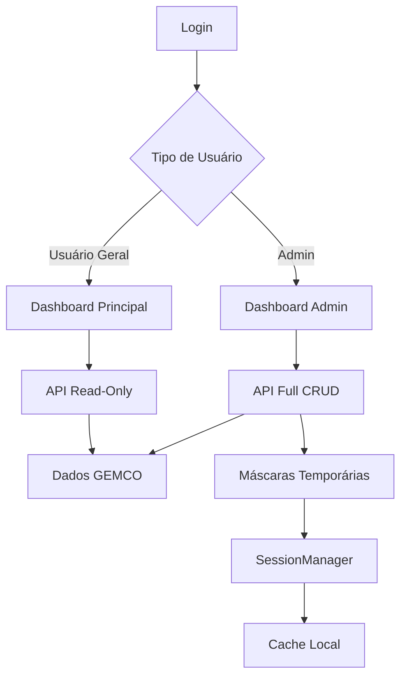

# 🌐 Frontend - Sistema de Agenda de Recebimento de Mercadorias

Este documento descreve a estrutura e funcionamento do frontend do Sistema de Agenda de Recebimento
de Mercadorias.

## 📁 Estrutura de Pastas

```
frontend/
├── admin/                  # Interface administrativa
├── assets/                 # Recursos estáticos (imagens, ícones)
├── login/                  # Página de autenticação
├── loja/                   # Interface para usuários gerais (nome mantido para compatibilidade)
└── shared/                 # Recursos compartilhados
```

## 🎯 Módulos do Sistema

### 🔐 Login (`/login`)

**Finalidade**: Página inicial de autenticação do sistema.

**Arquivos**:

- `login.html` - Interface de login responsiva
- `script-login.js` - Lógica de autenticação
- `styles-login-simples.css` - Estilos específicos do login

**Funcionalidades**:

- ✅ Seleção de tipo de acesso (Usuário Geral/Admin)
- 🔑 Integração com Microsoft Authentication (corporativo)
- 🎨 Interface moderna com cards de seleção
- 📱 Design responsivo
- 🔄 Redirecionamento automático baseado no perfil

---

### 👥 Interface do Usuário (`/loja`)

**Finalidade**: Dashboard para usuários gerais (logística, colaboradores) consultarem agendamentos.

**Arquivos**:

- `index.html` - Interface principal para usuários gerais
- `script-loja.js` - Lógica de consulta e visualização  
- `styles-loja.css` - Estilos específicos dos usuários gerais

**Funcionalidades**:

- 👀 **Visualização read-only** de agendamentos
- 🔍 Filtros por data, fornecedor, status
- 📊 Dashboard com estatísticas básicas
- 📄 Exportação para PDF
- 🌙 Toggle tema claro/escuro
- 🔄 Atualização automática de dados
- 📱 Interface responsiva

**Permissões**:

- ❌ Não pode criar agendamentos
- ❌ Não pode editar dados
- ❌ Não pode aprovar/rejeitar
- ✅ Apenas consulta e visualização

---

### ⚙️ Interface Administrativa (`/admin`)

**Finalidade**: Dashboard completo para administradores gerenciarem o sistema.

**Arquivos**:

- `index.html` - Interface principal administrativa
- `script-admin.js` - Lógica principal de administração
- `script-admin-crud.js` - Operações CRUD específicas
- `styles-admin.css` - Estilos administrativos

**Funcionalidades**:

- 📝 **CRUD completo** de agendamentos
- ✅ Aprovação/rejeição de agendamentos
- 🎭 **Sistema de máscaras temporárias** (modificações não persistentes)
- 📊 Relatórios e estatísticas avançadas
- 🔍 Filtros e buscas complexas
- 📄 Exportação para múltiplos formatos
- 👥 Gestão de usuários e permissões
- 🌙 Toggle tema claro/escuro
- 🔄 Sincronização em tempo real

**Recursos Especiais**:

- 🎭 **Máscaras Visuais**: Permite modificações temporárias que não afetam o sistema GEMCO
- 🔄 **Sincronização GEMCO**: Integração bidirecional com o sistema principal
- 📋 **Histórico de alterações**: Tracking completo de modificações
- ⚡ **Operações em lote**: Processamento múltiplo de agendamentos

---

### 🤝 Recursos Compartilhados (`/shared`)

#### 📋 Arquivos e Responsabilidades

**`config.js`** - Configurações globais

- 🔧 URLs de API por ambiente
- 🔐 Configurações de autenticação Microsoft
- ⚙️ Parâmetros do sistema
- 🎨 Temas e aparência
- 📊 Configurações de relatórios

**`api-manager.js`** - Gerenciador de API

- 🌐 Centralização de chamadas HTTP
- 🔄 Cache inteligente
- 📡 Gerenciamento de sessões
- 🛡️ Tratamento de erros
- 📊 Interceptadores de request/response

**`auth.js`** - Sistema de Autenticação

- 🔐 Login/logout
- 🔑 Gerenciamento de tokens
- ⏰ Controle de sessão
- 🔄 Renovação automática
- 👤 Gestão de perfis de usuário

**`utils.js`** - Utilitários gerais

- 📅 Formatação de datas
- 💰 Formatação de valores
- 🎨 Helpers de interface
- 📄 Exportação de dados
- 🔍 Funções de validação

**`styles-common.css`** - Estilos base

- 🎨 CSS reset e normalize
- 🌙 Sistema de temas (claro/escuro)
- 📱 Grid responsivo
- 🎯 Componentes reutilizáveis
- 💫 Animações e transições

---

### 🖼️ Assets (`/assets`)

**`Logo.png`** - Logo utilizada em todas as interfaces.

---

## 🏗️ Arquitetura do Frontend

### 📡 Comunicação com Backend

```
Frontend ←→ Backend API ←→ Database/GEMCO
```

- **Protocolo**: REST API com JSON
- **Autenticação**: Bearer tokens + Session IDs
- **Cache**: Inteligente com invalidação automática
- **Offline**: Modo somente leitura com dados em cache

### 🎭 Sistema de Máscaras Temporárias

Uma das funcionalidades mais inovadoras do sistema:

```
Dados GEMCO + Máscaras Temporárias = Visão do Usuário
```

**Como funciona**:

1. 📊 Dados originais permanecem intactos no GEMCO
2. 🎭 Modificações ficam em camada temporária
3. 👀 Interface mostra a visão "mascarada"
4. ⏰ Máscaras expiram automaticamente
5. 🔄 Sincronização não afeta dados originais

**Vantagens**:

- ✅ Testes seguros sem afetar produção
- 🎨 Preview de alterações
- 🔄 Rollback instantâneo
- 👥 Modificações por usuário/sessão

### 🌙 Sistema de Temas

**Temas Disponíveis**:

- ☀️ **Claro** (padrão)
- 🌙 **Escuro** (low-light)

**Implementação**:

- CSS Custom Properties (variáveis)
- Persistência em localStorage
- Transições suaves entre temas
- Acessibilidade completa

### 📱 Responsividade

**Breakpoints**:

- 📱 Mobile: < 768px
- 📟 Tablet: 768px - 1024px
- 🖥️ Desktop: > 1024px

**Estratégia**:

- Mobile-first approach
- Flexbox e CSS Grid
- Imagens adaptativas
- Touch-friendly interfaces

---

## 🛠️ Tecnologias Utilizadas

### 📚 Frontend Stack

- **HTML5**: Estrutura semântica
- **CSS3**: Estilos modernos + Custom Properties
- **JavaScript ES6+**: Lógica de aplicação
- **Fetch API**: Comunicação HTTP
- **LocalStorage**: Persistência local
- **FontAwesome**: Ícones vetoriais

### 🎨 Frameworks e Bibliotecas

- **Nenhum framework pesado**: Vanilla JS para performance
- **FontAwesome 6.0**: Biblioteca de ícones
- **CSS Grid + Flexbox**: Layout moderno
- **Web Components**: Componentização nativa

---

## 🚀 Funcionalidades por Perfil

### 👤 Usuário Geral

| Funcionalidade              | Disponível | Observações     |
| --------------------------- | ---------- | --------------- |
| Visualizar agendamentos     | ✅         | Somente leitura |
| Filtrar por data/fornecedor | ✅         | Filtros básicos |
| Exportar relatórios         | ✅         | PDF básico      |
| Criar agendamentos          | ❌         | Sem permissão   |
| Editar dados                | ❌         | Sem permissão   |
| Aprovar/Rejeitar            | ❌         | Sem permissão   |

### 👑 Administrador

| Funcionalidade                    | Disponível | Observações              |
| --------------------------------- | ---------- | ------------------------ |
| Todas as funcionalidades do usuário | ✅         | Herda permissões         |
| Criar agendamentos               | ✅         | Com validação            |
| Editar qualquer agendamento      | ✅         | Com histórico            |
| Aprovar/Rejeitar                 | ✅         | Com justificativa        |
| Gerenciar usuários               | ✅         | CRUD completo            |
| Máscaras temporárias             | ✅         | Funcionalidade exclusiva |
| Relatórios avançados             | ✅         | Múltiplos formatos       |
| Configurações do sistema         | ✅         | Acesso total             |

---

## 🔧 Configuração e Personalização

### ⚙️ Variáveis de Configuração

Edite `shared/config.js` para personalizar:

```javascript
// Exemplo de configurações importantes
window.SYSTEM_CONFIG = {
  app: {
    name: 'Sistema de Agenda...',
    company: 'MyCompany',
    environment: 'development' // production
  },
  api: {
    development: {
      baseURL: 'http://localhost:3000/api'
    }
  },
  auth: {
    microsoft: {
      clientId: 'your-client-id',
      tenantId: 'your-tenant-id'
    }
  }
};
```

### 🎨 Personalização de Temas

Modifique `shared/styles-common.css`:

```css
:root {
  /* Tema Claro */
  --bg-primary: #ffffff;
  --text-primary: #333333;
  --accent-color: #007bff;
}

[data-theme='dark'] {
  /* Tema Escuro */
  --bg-primary: #1a1a1a;
  --text-primary: #ffffff;
  --accent-color: #4dabf7;
}
```

---

## 📊 Fluxo de Dados



---

## 🔍 Debugging e Desenvolvimento

### 🛠️ Ferramentas de Debug

**Console do Browser**:

```javascript
// Verificar configurações
console.log(window.SYSTEM_CONFIG);

// Status da autenticação
console.log(localStorage.getItem('auth_token'));

// Dados em cache
console.log(sessionStorage);
```

**Network Tab**:

- Monitorar chamadas de API
- Verificar headers de autenticação
- Analisar tempo de resposta

### 📋 Checklist de Problemas Comuns

- [ ] Verificar se backend está rodando
- [ ] Conferir URLs de API em config.js
- [ ] Validar token de autenticação
- [ ] Limpar cache do browser
- [ ] Verificar console por erros JavaScript
- [ ] Testar em modo incógnito

---

## 📈 Performance e Otimização

### ⚡ Estratégias Implementadas

- **Lazy Loading**: Carregamento sob demanda
- **Cache Inteligente**: Reduz chamadas desnecessárias
- **Debouncing**: Otimiza filtros e buscas
- **Compression**: Minificação de assets
- **CDN**: FontAwesome via CDN

### 📊 Métricas de Performance

- **First Contentful Paint**: < 1.5s
- **Time to Interactive**: < 3s
- **Bundle Size**: < 500KB total
- **Cache Hit Rate**: > 80%

---

## 🔮 Roadmap e Melhorias Futuras

### 🆕 Próximas Funcionalidades

- [ ] 📱 PWA (Progressive Web App)
- [ ] 🔔 Notificações push
- [ ] 📊 Dashboard analytics
- [ ] 🌐 Modo offline completo
- [ ] 🎯 Personalização de dashboard
- [ ] 📱 App mobile nativo

### 🛠️ Melhorias Técnicas

- [ ] TypeScript migration
- [ ] Service Workers
- [ ] Virtual scrolling
- [ ] Component framework (Vue/React)
- [ ] Automated testing
- [ ] Storybook documentation

---

## 📞 Suporte e Contato

**Documentação**: `/docs`  
**Issues**: Sistema interno de tickets

---

_Versão 1.1.0 - Setembro 2025 | Atualização: Sistema "usuario" + Microsoft AD_  
_Este documento é mantido atualizado pela equipe de desenvolvimento._
