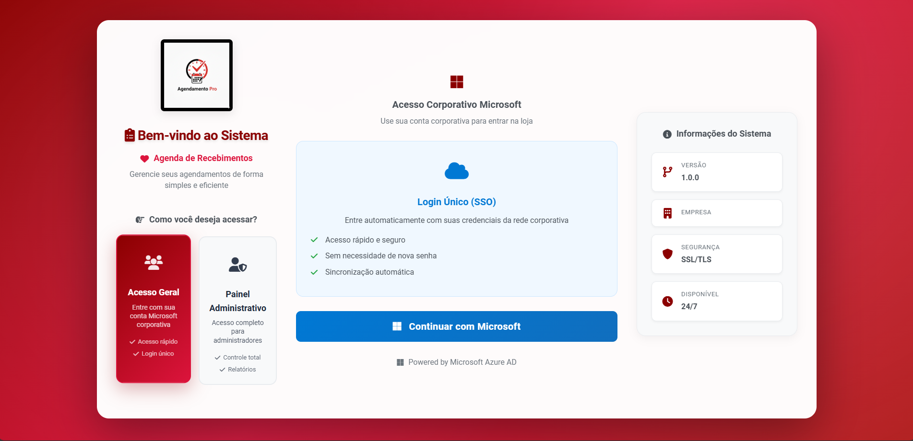
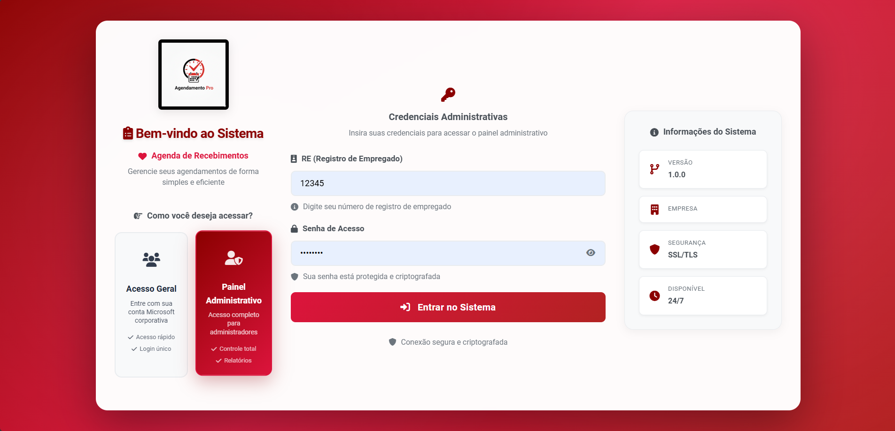
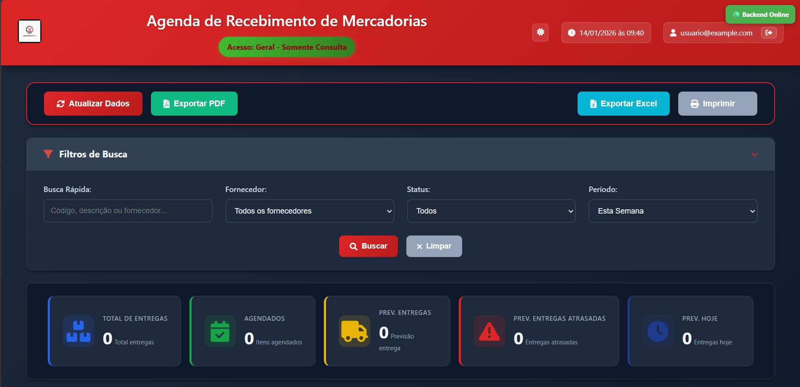
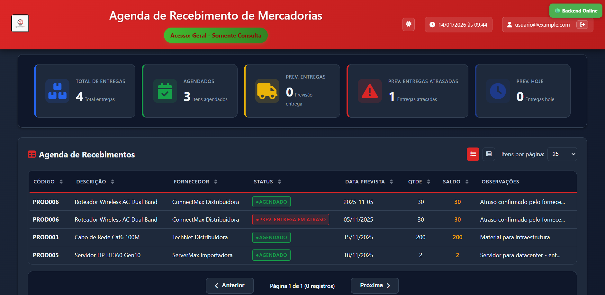
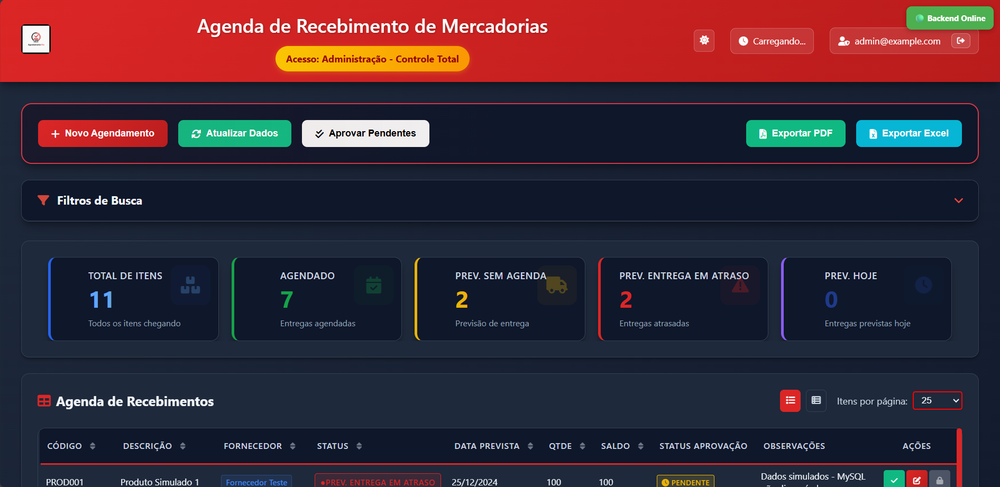
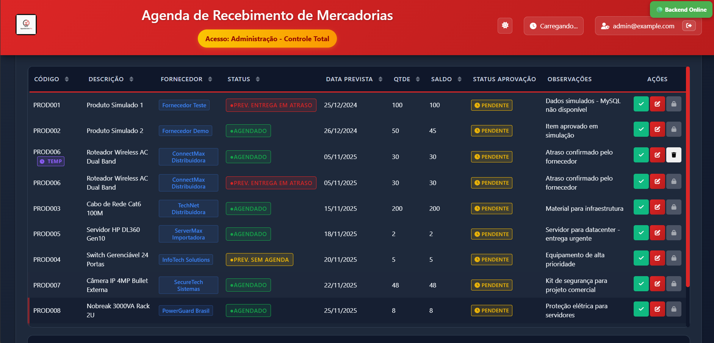
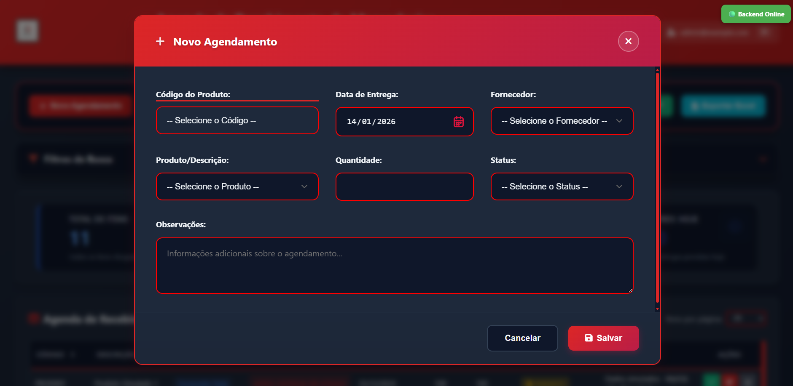
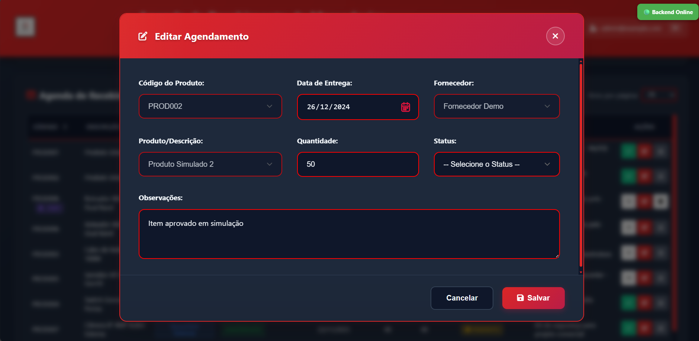

# 📋 Sistema de Agenda de Recebimento de Mercadorias

> **Projeto de Extensão Universitária** desenvolvido para otimização de processos internos em empresa de grande porte do setor varejista.

Sistema completo para gerenciamento de agendamentos de recebimento de mercadorias, implementando uma **arquitetura híbrida inovadora** que combina controle administrativo avançado com interfaces otimizadas para diferentes tipos de usuário.

## 📖 Sobre o Projeto

Este projeto foi desenvolvido como parte de um **projeto de extensão universitária**, com foco na melhoria de processos internos de uma empresa de grande porte do setor varejista. O sistema visa otimizar o fluxo de recebimento de mercadorias, eliminando gargalos operacionais e proporcionando maior controle e visibilidade sobre os agendamentos.

## 📸 **Screenshots do Sistema**

### 🔐 Interface de Login
Autenticação dupla: acesso geral via Microsoft AD ou painel administrativo com credenciais.

<div align="center">
  
  <br>
  
</div>

### 👥 Interface de Usuário Geral (Loja)
Visualização otimizada para consulta de agendamentos aprovados.

<div align="center">
  
  <br>
  
</div>

### 🛡️ Painel Administrativo
Controle total sobre agendamentos com sistema de aprovação e gestão avançada.

<div align="center">
  
  <br>
  
</div>

### ✏️ Operações CRUD
Criação e edição de agendamentos com validações e máscaras temporárias.

<div align="center">
  
  <br>
  
</div>

---

## ✨ **Características Principais**

- 🎯 **Interfaces diferenciadas** para admin e usuários gerais
- 🔐 **Sistema de aprovação robusto** com controle granular
- 🔄 **Integração com sistemas existentes** (GEMCO/ERP)
- ⚡ **Performance otimizada** para ambiente corporativo
- 🚀 **APIs RESTful completas** com documentação OpenAPI
- 🔐 **Autenticação via Microsoft AD**
- �🛡️ **Pipeline de segurança** com análise de vulnerabilidades
- 🧪 **Sistema de testes automatizados** com CI/CD

---

## 📚 **Documentação Técnica**

Para informações técnicas completas, consulte:

- 📚 **[INDICE-DOCUMENTACAO.md](./INDICE-DOCUMENTACAO.md)** - Índice completo de toda documentação
- 🚀 **[API-MESTRE.md](./API-MESTRE.md)** - Documentação mestre das APIs
- 🎨 **[FRONTEND-README.md](./FRONTEND-README.md)** - Frontend (interfaces, componentes, estilos)
- ⚙️ **[BACKEND-README.md](./BACKEND-README.md)** - Backend (arquitetura, APIs, banco)
- 🛠️ **[LOGGING-TESTES.md](./LOGGING-TESTES.md)** - Sistema de logging e testes
- 🔐 **[CONFIGURACAO-SNYK.md](./CONFIGURACAO-SNYK.md)** - Segurança e análise de vulnerabilidades

---

## 🎯 **SOBRE O SISTEMA**

### 🏗️ **Arquitetura Híbrida**

O sistema implementa um conceito inovador que combina:

```
┌─────────────────┐    ┌──────────────────┐    ┌─────────────────┐
│   Frontend      │ ←→ │  Backend API     │ ←→ │  MySQL/GEMCO    │
│                 │    │                  │    │                 │
│ - Admin UI      │    │ - REST API       │    │ - Dados Reais   │
│ - Usuario UI    │    │ - Session Mgmt   │    │ - Histórico     │
│ - Auth System   │    │ - Híbrido Logic  │    │ - Configurações │
└─────────────────┘    └──────────────────┘    └─────────────────┘
                                ↕️
                       ┌──────────────────┐
                       │ Máscaras Temp    │
                       │ (Visual Only)    │
                       └──────────────────┘
```

### 🎭 **Sistema de Máscaras Temporárias**

**Funcionalidade única** que permite modificações visuais sem afetar dados do GEMCO:

- ✨ **Edições temporárias** que não persistem no sistema real
- 👀 **Visualização híbrida** (dados reais + máscaras)
- ⏰ **Expiração automática** de modificações
- 🔒 **Isolamento por usuário** para segurança

### 💡 **Níveis de Acesso**

#### 🔐 **Nível Administrativo**

- Login via **RE + senha** (ex: `12345` + `admin123`)
- Visualiza **todos** os agendamentos (pendentes, aprovados, rejeitados)
- **Aprova ou rejeita** cada agendamento individualmente
- **Controla** o que os usuários gerais podem visualizar
- **Gerencia máscaras temporárias** e aprovações

#### 👥 **Nível Operacional (Usuários Gerais)**

- **Auto-login via Microsoft AD** (integração com intranet corporativa)
- Visualiza **apenas** agendamentos **aprovados** pelo admin
- Interface **otimizada** para consulta por usuários dos diversos departamentos
- **Acesso restrito** apenas a dados validados

## 🚀 INSTALAÇÃO RÁPIDA

### **1. Pré-requisitos**

- **Node.js** >= 16.0.0
- **MySQL** >= 8.0 (ou MariaDB)
- **NPM** ou **Yarn**

### **2. Setup Automático**

```bash
# 1. Navegar para o backend
cd backend

# 2. Instalar dependências
npm install

# 3. Configuração de ambiente automática
npm run setup:env local

# 4. Setup completo do banco
npm run install-complete

# 5. Iniciar servidor
npm start
```

### **3. Verificação**

```bash
# Testar se está funcionando:
curl http://localhost:3000/api/health

# Acessar interfaces:
# Admin:    http://localhost:3000/admin/
# Usuários: http://localhost:3000/loja/
```

> 📖 **Para configuração detalhada, troubleshooting e setup de produção, consulte
> [BACKEND-README.md](./BACKEND-README.md). Para APIs completas e exemplos, veja
> [API-MESTRE.md](./API-MESTRE.md)**

## 🏗️ VISÃO GERAL DA ARQUITETURA

### **📁 Estrutura Principal**

```
AgendaReceb_Mercadorias/
├── 📊 backend/                 # Backend Express.js + MySQL
│   ├── server-hibrido.js      # Servidor principal com sistema híbrido
│   ├── database/              # DatabaseManager + schema SQL
│   ├── src/                   # Código fonte (MVC + Services)
│   │   ├── routes/            # APIs REST
│   │   ├── services/          # Lógica híbrida de negócios
│   │   ├── middleware/        # Auth + validação
│   │   └── utils/             # Logger + utilitários
│   └── scripts/               # Setup automatizado
├── 🎨 frontend/                # Interfaces otimizadas
│   ├── admin/                 # Painel administrativo completo
│   ├── loja/                  # Interface para usuários gerais (todos departamentos)
│   ├── login/                 # Sistema de autenticação
│   └── shared/                # API client + utilitários
└── 📚 docs/                   # Documentação técnica completa
    ├── INDICE-DOCUMENTACAO.md # Índice completo da documentação
    ├── README.md              # Este arquivo (visão geral)
    ├── API-MESTRE.md          # Documentação mestre das APIs
    ├── FRONTEND-README.md     # Documentação completa frontend
    ├── BACKEND-README.md      # Documentação completa backend
    ├── LOGGING-TESTES.md      # Sistema de logging e testes
    ├── CONFIGURACAO-SNYK.md   # Configuração de segurança
    ├── openapi.yaml           # Especificação OpenAPI
    └── postman-collection.json # Collection para testes
```

### **🔄 Fluxo de Dados Híbrido**

```
┌─────────────────┐    🔄    ┌─────────────────┐    💾    ┌─────────────────┐
│     Admin       │ ←─────→  │   Express API   │ ←─────→  │  MySQL (GEMCO)  │
│  (Controle)     │          │  (Híbrido)      │          │  (Dados Reais)  │
└─────────────────┘          └─────┬───────────┘          └─────────────────┘
                                   │                               ↕️
                                   │ 🎭                   ┌─────────────────┐
                                   │                      │ Máscaras Temp   │
                                   ↓                      │ (SessionManager)│
                             ┌─────────────────┐          └─────────────────┘
                             │    Usuários     │
                             │ (Só Aprovados)  │
                             └─────────────────┘
```

> 🔍 **Para detalhes técnicos de cada camada, consulte:**
> - **[API-MESTRE.md](./API-MESTRE.md)** - APIs completas e exemplos
> - **[Frontend](./FRONTEND-README.md)** - Interfaces e componentes
> - **[Backend](./BACKEND-README.md)** - Arquitetura e configuração

## 🔐 SISTEMA DE AUTENTICAÇÃO

### **👨‍💼 Usuários Administrativos**

Login via **RE + Senha**:

- `12345` + `admin123` - Administrador Principal
- `67890` + `super456` - Supervisor Geral
- `11111` + `gestor789` - Gestor TI

### **👥 Usuários Gerais (Logística e outros setores)**

- 🔐 Login via **Microsoft AD** (automático)
- 📊 **Dashboard** com agendamentos aprovados
- 🎯 **Foco** em visualização e acompanhamento
- Redirecionamento direto para interface principal

### **🛡️ Segurança Implementada**

- **JWT Tokens** com expiração configurável
- **Session Management** isolado por usuário
- **Validação de entrada** em todas as rotas
- **Hash de senhas** com bcrypt
- **CORS** configurado para produção

> 📖 **Para detalhes sobre middleware de autenticação e configuração de segurança, consulte:**
> - **[BACKEND-README.md](./BACKEND-README.md)** - Arquitetura e configuração
> - **[API-MESTRE.md](./API-MESTRE.md)** - Sistema de autenticação completo
> - **[CONFIGURACAO-SNYK.md](./CONFIGURACAO-SNYK.md)** - Configuração de segurança

---

## 📱 INTERFACES DO SISTEMA

### 👨‍💼 **Painel Administrativo**

**Recursos Completos**:

- 📊 Dashboard com estatísticas em tempo real
- ➕ Criar/Editar agendamentos (com máscaras temporárias)
- ✅ Sistema de aprovação/rejeição
- �️ Gestão completa do ciclo de vida
- � Exportação de relatórios

### 👥 **Interface de Usuário Geral**

**Interface Otimizada**:

- 📋 Visualização apenas de dados aprovados
- 🔍 Filtros inteligentes e busca
- 📱 Design responsivo (mobile/desktop)
- ⚡ Atualizações em tempo real

### 🎨 **Design System**

| Componente  | Admin        | Usuário         | Características         |
| ----------- | ------------ | --------------- | ----------------------- |
| **Header**  | ✅ Completo  | ✅ Simplificado | Navegação contextual    |
| **Tables**  | ✅ Editáveis | ✅ Read-only    | Responsivas             |
| **Forms**   | ✅ CRUD      | ❌ N/A          | Validação client/server |
| **Filters** | ✅ Avançados | ✅ Básicos      | Busca em tempo real     |

> 🎨 **Para detalhes sobre componentes, estilos e responsividade, consulte
> [FRONTEND-README.md](./FRONTEND-README.md)**

## 🛠️ API E TECNOLOGIAS

### **🌐 Principais Endpoints**

```http
# Autenticação
POST   /api/auth/login              # Login admin (RE + senha)
POST   /api/auth/login-usuario      # Auto-login usuários via Microsoft AD
POST   /api/auth/login-loja         # Auto-login compatibilidade (descontinuado)
GET    /api/auth/me                 # Dados do usuário atual

# Agendamentos (Sistema Híbrido)
GET    /api/agendamentos/admin      # Todos (admin) - com máscaras
GET    /api/agendamentos            # Aprovados (usuários) - filtrados
POST   /api/agendamentos            # Criar (máscara temporária)
PUT    /api/agendamentos/:id        # Editar (não persiste no GEMCO)
POST   /api/agendamentos/:id/aprovar # Aprovar para usuários

# Utilitários
GET    /api/health                  # Status do sistema
GET    /api/gemco/dados             # Dados originais (sem máscaras)
```

> 🚀 **Para documentação completa das APIs, exemplos, códigos de erro e testes, consulte:**
> - **[API-MESTRE.md](./API-MESTRE.md)** - Documentação mestre completa das APIs
> - **[openapi.yaml](./openapi.yaml)** - Especificação OpenAPI
> - **[postman-collection.json](./postman-collection.json)** - Collection para testes

### **⚡ Stack Tecnológico**

#### **Backend**

- **Node.js** + **Express.js** - API REST
- **MySQL** - Banco de dados principal (compatível com GEMCO)
- **JWT** - Autenticação stateless
- **bcrypt** - Hash de senhas
- **express-validator** - Validação de entrada

#### **Frontend**

- **Vanilla JS** - Sem frameworks (performance)
- **CSS3** - Grid/Flexbox + Responsivo
- **Fetch API** - Comunicação assíncrona
- **Web Components** - Componentes reutilizáveis

#### **Arquitetura**

- **MVC Pattern** - Separação de responsabilidades
- **Service Layer** - Lógica de negócios híbrida
- **Middleware** - Autenticação e validação
- **Session Management** - Máscaras temporárias

> 🔧 **Para configuração completa de ambiente, deployment e troubleshooting, consulte:**
> - **[BACKEND-README.md](./BACKEND-README.md)** - Configuração e arquitetura
> - **[LOGGING-TESTES.md](./LOGGING-TESTES.md)** - Sistema de testes e CI/CD
> - **[CONFIGURACAO-SNYK.md](./CONFIGURACAO-SNYK.md)** - Pipeline de segurança

---

## 🏢 IMPLANTAÇÃO EMPRESARIAL

### **📋 Checklist de Deploy**

- [ ] ✅ Ambiente local testado e funcionando
- [ ] 🔧 MySQL da empresa configurado
- [ ] 👥 Usuários administrativos cadastrados
- [ ] 🔐 Integração Microsoft configurada
- [ ] 📊 Dados existentes migrados
- [ ] 🧪 Testes com usuários finais
- [ ] 🚀 Deploy em servidor de produção

### **🔄 Integração com Sistemas Existentes**

```javascript
// Exemplo: Adaptação para ERP existente
async buscarProdutos() {
    return await this.executarQuery(`
        SELECT
            codigo_produto as codAnt,
            descricao_produto as descricao,
            categoria, preco_custo as valorCusto
        FROM SUA_TABELA_ERP    -- 👈 Adaptar aqui
        WHERE ativo = 1
    `);
}
```

### **🏭 Configuração Produção**

```env
# .env para ambiente empresarial
NODE_ENV=production
DB_HOST=servidor-mysql-empresa
DB_USER=usuario_sistema_agenda
DB_PASSWORD=senha_segura_empresa
DB_NAME=agenda_mercadorias
```

## 🔍 TROUBLESHOOTING RÁPIDO

### **❌ Problemas Comuns**

| Problema              | Solução Rápida                               | Documentação                                       |
| --------------------- | -------------------------------------------- | -------------------------------------------------- |
| MySQL não conecta     | Verificar se servidor está ativo             | [Backend](./BACKEND-README.md#troubleshooting)    |
| Frontend não carrega  | Verificar `http://localhost:3000/api/health` | [Frontend](./FRONTEND-README.md#debug)             |
| Login não funciona    | Verificar JWT_SECRET no .env                 | [API-MESTRE.md](./API-MESTRE.md#autenticacao)     |
| Máscaras não aparecem | Verificar permissões do JSON file            | [Backend](./BACKEND-README.md#mascaras)            |
| Testes falhando       | Executar `npm run test:setup`                | [LOGGING-TESTES.md](./LOGGING-TESTES.md#testes)   |
| Vulnerabilidades      | Configurar SNYK_TOKEN                        | [CONFIGURACAO-SNYK.md](./CONFIGURACAO-SNYK.md)    |

### **🧪 Testes Rápidos**

```bash
# Testar API
curl http://localhost:3000/api/health

# Testar autenticação
curl -X POST http://localhost:3000/api/auth/login \
  -H "Content-Type: application/json" \
  -d '{"re":"12345","senha":"admin123"}'

# Executar testes automatizados
cd backend
npm test

# Verificar logs
npm start  # Ver logs no console
```

> 🧪 **Para testes completos e CI/CD, consulte [LOGGING-TESTES.md](./LOGGING-TESTES.md)**

---

## � MELHORIAS FUTURAS

### **📋 Roadmap Técnico**

- [ ] 🔄 **WebSocket** - Atualizações em tempo real
- [ ] 📊 **Dashboard Analytics** - Gráficos avançados
- [ ] 📱 **PWA** - App mobile nativo
- [ ] 🔐 **OAuth2** - Integração corporativa avançada
- [ ] 📧 **Notificações** - Email/SMS automáticos
- [ ] 🤖 **API GraphQL** - Queries flexíveis
- [ ] 🛡️ **Segurança Avançada** - Multi-factor auth
- [ ] 🔍 **Monitoring** - APM e observabilidade

### **🎯 Melhorias de UX**

- [ ] 🌙 **Tema escuro** - Mode switcher
- [ ] 🔍 **Busca avançada** - Filtros complexos
- [ ] 📤 **Drag & Drop** - Upload de arquivos
- [ ] 💬 **Sistema de comentários** - Workflow colaborativo
- [ ] 📋 **Workflows personalizáveis** - Aprovação multi-nível

---

## 📞 SUPORTE E CONTATO

**Documentação Técnica**:

- 🏠 **Geral**: [README.md](./README.md) (este arquivo)
- 🎨 **Frontend**: [FRONTEND-README.md](./FRONTEND-README.md)
- ⚙️ **Backend**: [BACKEND-README.md](./BACKEND-README.md)
- � **Logs**: [LOGGING.md](./LOGGING.md)

---

## 📈 SOBRE O PROJETO

**Sistema de Agenda de Recebimento de Mercadorias**  
Desenvolvido para otimização de processos logísticos. Estou postando ele aqui como portifólio e registro, uma vez que irei refatora-lo por completo usando novas técnologias como React, Tailwind, e talvez Next. Podem utilizar ele para quaisuqer fins dentro da proposta da licença do MIT. 

Tenha em mente que isso é um dos meus primeiros projetos maiores e mais complexos.
Se gostou considere dar uma estrela.

**Características Principais**:

- ✨ **Arquitetura híbrida inovadora** com máscaras temporárias
- 🎯 **Interfaces diferenciadas** para admin e operacional
- � **Sistema de aprovação robusto** com controle granular
- � **Integração com sistemas existentes** (GEMCO/ERP)
- � **Performance otimizada** para ambiente corporativo

---

_Versão 1.1.0 - Setembro 2025 | Atualização: Perfil "usuario" + Microsoft AD_
